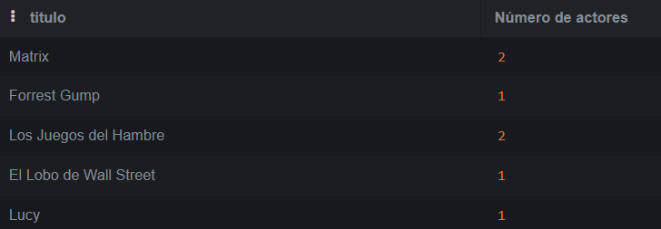

# Consultas de SQL
## SELECT, FROM, WHERE, GROUP BY y JOINS

*Mariana Aguayo*

1. total de usuarios por país ---> aquí es necesario mostras el nombre del país y el total de usuarios como número
```
SELECT Paises.nombre, 
       COUNT(Usuarios.id) AS 'Usuarios por pais' 
FROM Paises
LEFT JOIN Usuarios ON Usuarios.pais_id = Paises.id
GROUP BY Paises.id;
```


2. número de actores registrados por película ---> mostrar el nombre de la película y el total de actores
```
SELECT Peliculas.titulo, 
       COUNT(Actores.id) AS 'Número de actores' 
FROM PeliculaActor
JOIN Actores On Actores.id = PeliculaActor.actor_id
JOIN Peliculas ON Peliculas.id = PeliculaActor.pelicula_id
GROUP BY Peliculas.id;
```


3. mostrar las películas en las que haya dos o más actores ---> mostrar el nombre de la película únicamente (tip: la respuesta de la consulta anterior te puede ayudar a contestar esta)
```
SELECT Peliculas.titulo from Actores
JOIN PeliculaActor On Actores.id = PeliculaActor.actor_id
JOIN Peliculas ON Peliculas.id = PeliculaActor.pelicula_id
GROUP BY Peliculas.id
HAVING COUNT(Actores.id) >= 2;
```


4. total de usuarios registrados por año -> mostrar el año a cuatro dígitos YYYY y el total de usuarios
```
SELECT strftime('%Y', fecha_registro) As 'Año', 
       COUNT(Usuarios.id) AS 'Usuarios registrados por año' 
FROM Usuarios
GROUP BY strftime('%Y', fecha_registro);
```


5. total de usuarios registrados por país y por año -> mostrar el país, el año y el total de personas registradas en ese país y en ese año
```
select Paises.nombre, 
	   strftime('%Y', fecha_registro) As 'Año', 
       COUNT(Usuarios.id) AS 'Usuarios registrados por año' 
FROM Usuarios
LEFT JOIN Paises ON Paises.id = Usuarios.pais_id
GROUP BY strftime('%Y', fecha_registro), Paises.nombre;
```


6. peliculas por actor -> debe mostrar el nombre del actor y el nombre de la película
```
SELECT Actores.nombre, 
       Peliculas.titulo 
FROM Actores
JOIN PeliculaActor On Actores.id = PeliculaActor.actor_id
JOIN Peliculas ON Peliculas.id = PeliculaActor.pelicula_id;
```

7. los actores que aparezcan en la película "Los Juegos del Hambre" -> esto debe de ser filtrado por el texto "Los Juegos del Hambre" en tu query. Debes hacer JOINS de las tablas actores, pelicula actor y pelicula 
```
SELECT Actores.nombre, 
       Peliculas.titulo 
FROM Actores
JOIN PeliculaActor On Actores.id = PeliculaActor.actor_id
JOIN Peliculas ON Peliculas.id = PeliculaActor.pelicula_id
WHERE Peliculas.titulo = 'Los Juegos del Hambre';
```


8. ¿Cuántos minutos ha empleado cada usuario en ver las películas? -> nombre del usuario y la cantidad de minutos acumulada entre todas las películas
```
SELECT Usuarios.nombre, 
       SUM(minutos_vistos) AS 'Minutos totales' 
FROM Usuarios
JOIN Reproducciones ON Reproducciones.usuario_id = Usuarios.id
GROUP BY Usuarios.id;
```

9. Películas que no hayan tenido reproducciones
```
SELECT Peliculas.titulo 
FROM Peliculas 
WHERE Peliculas.id NOT IN 
(SELECT Reproducciones.pelicula_id FROM Reproducciones);
```

reto:
10. actores de las películas que hayan sido vistas por usuarios de España
```
SELECT Actores.nombre FROM Actores
JOIN PeliculaActor ON PeliculaActor.actor_id = Actores.id
JOIN Reproducciones ON Reproducciones.pelicula_id = PeliculaActor.pelicula_id
JOIN Usuarios ON Usuarios.id = Reproducciones.usuario_id
JOIN Paises ON Usuarios.pais_id = Paises.id
WHERE Paises.nombre = 'España';
```
